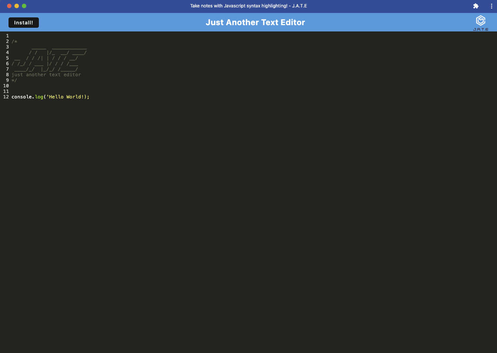

# PWA-TextEditor 


## Description
This application is a Text Edit (Just Another Text Editor) that runs in the browser. It is a single page application that meets the PWA criteria. It also features a number of data persistence techniques such as indexDB, local storage and memory caching to serve as redundancy in case one is not supported by the browser. This application is also designed to function offline with offline fallback to cached data. 


## Table of Contents

- [Installation](#installation)
- [Usage](#usage)
- [Example](#example)
- [Contributors](#contributors)
- [Deploy](#deploy)
- [License](#license)
- [Questions](#questions)

## Installation

```
npm install
npm start
```

## Usage
This application is designed to serve as a Text Editor that runs in the browser. It will allow the user to type code that is formatted using Code-Mirror-Themes and it will cache this code in the browser using indexDB. This application meets the criteria of a PWA and the user can install it to their machine using the install button on the homepage. Once installed, it will mimick a native application and run outside of the browser in it's own window. 


## Example




## Contributors

* [Chase Ostien](https://github.com/ChaseOstien)

## Deploy

Website: https://j-a-t-e-p-w-a-25155f7ea5a4.herokuapp.com/

## License

ISC License

https://opensource.org/licenses/ISC

## Questions

For additional questions, contact me at the email provided below.

- GitHub: [PWA-TextEditor](https://github.com/ChaseOstien/PWA-TextEditor)
- Heroku: [j-a-t-e-p-w-a](https://j-a-t-e-p-w-a-25155f7ea5a4.herokuapp.com/)
- Chaseostien@gmail.com